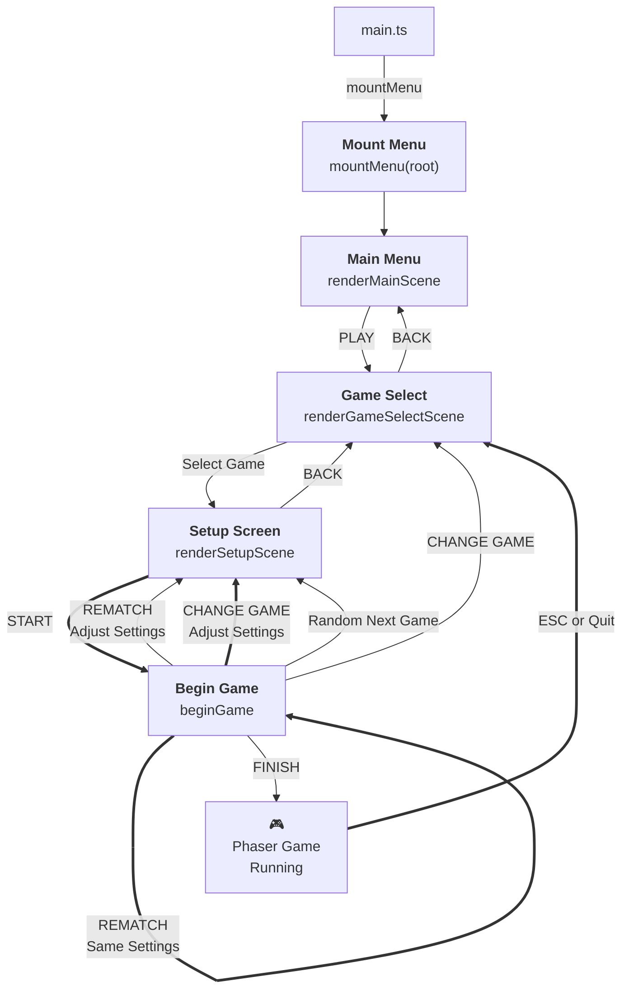

# Menu Navigation Flow

## Flow Overview

- **Boxes**: Menu navigation screens and game states
- **Diamonds**: Conditional routing (2-player check)
- **Arrows**: Transitions and what triggers them

The menu system handles navigation between screens, game selection, player setup, and game lifecycle management. Shared state like `pendingGameId`, `savedPlayerNames`, and `matchWins` is owned by `mountMenu()` and passed to the relevant screen callbacks.
